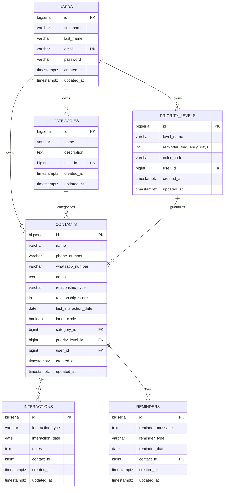

# BondKeeper — Entity Relationship Diagram

## Mermaid ER Diagram

## Relationship Summary

| Parent        | Child           | Cardinality | On Delete   |
|---------------|-----------------|-------------|-------------|
| User          | Category        | 1:N         | CASCADE     |
| User          | PriorityLevel   | 1:N         | CASCADE     |
| User          | Contact         | 1:N         | CASCADE     |
| Category      | Contact         | 1:N         | SET NULL    |
| PriorityLevel | Contact         | 1:N         | SET NULL    |
| Contact       | Interaction     | 1:N         | CASCADE     |
| Contact       | Reminder        | 1:N         | CASCADE     |

## Constraints

- **Unique**: `(user_id, name)` on categories
- **Unique**: `(user_id, level_name)` on priority_levels
- **Unique**: `email` on users
- **Check**: `relationship_score` between 0 and 100
- **Check**: `reminder_frequency_days` > 0

## Enum Values

### relationship_type (Contact)
`FAMILY`, `FRIEND`, `MENTOR`, `COLLEAGUE`, `RELATIVE`, `OTHER`

### interaction_type (Interaction)
`CALL`, `MESSAGE`, `MEETING`, `VIDEO_CALL`, `EMAIL`, `SOCIAL`, `OTHER`

### reminder_type (Reminder)
`BIRTHDAY`, `ANNIVERSARY`, `FOLLOW_UP`, `CHECK_IN`, `CUSTOM`

## Indexes

| Table          | Index                              | Purpose                    |
|----------------|------------------------------------|----------------------------|
| categories     | user_id                            | User-scoped queries        |
| priority_levels| user_id                            | User-scoped queries        |
| contacts       | user_id                            | User-scoped queries        |
| contacts       | (user_id, inner_circle) partial    | Inner circle filter        |
| interactions   | contact_id, interaction_date DESC  | Contact history timeline   |
| reminders      | contact_id, reminder_date          | Due reminder lookups       |
